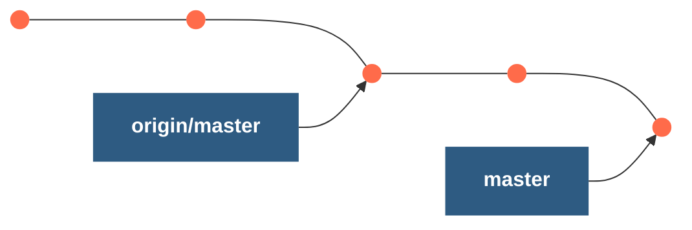

# Remote tracking branches - what are they?

- **Definition:** They represent where a specific branch was pointing the last time you communicated with that remote repository.
    
- Naming Pattern: /
    
**Examples**

- `origin/master`**origin/master**: References the state of the `master` branch on the remote repository named `origin`.
    
- `upstream/logoRedesign`**upstream/logoRedesign**: References the state of the `logoRedesign` branch on the remote repository named `upstream` (a common name for an upstream remote).

You can see the name of the remote branch by using:

```git
git branch -r
```
# Checking out remote tracking branches

**My Computer**

I make another commit, and the local branch reference moves again.



Remote reference doesn't move!

**When I run git status**

```bash
$ git status
On branch master
Your branch is ahead of 'origin/master' by 2 commits.
  (use "git push" to publish your local commits)
```

You will end up with a detached HEAD but below would put you back in the right place.

```git
git checkout origin/main 
```

Those 2 commits would be on the local master branch.
# Working with remote branches

https://github.com/Colt/remote-branches-demo

So when you close that repo - you only see the master branch even though you have multiple remote branches - you get all the history and all the data but that doesnt mean its in your workspace.

Running:

```git
git branch -r
```
Will display all branches in the remote repo.

Checkout with:

```git
git checkout origin/<branch>
```

# test
# test
# test
# test
# test
# test