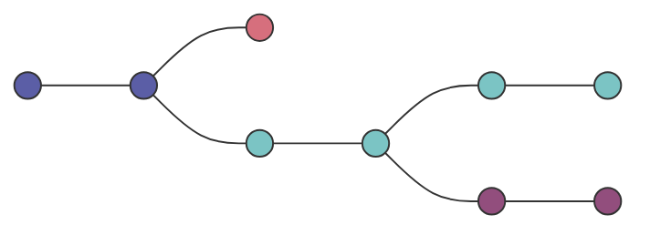

# Introducing Branches

Every commit we make it creates a hash, which is a unique identifier. This is important before we start.

As you can see below commits have a linear history. 

| Commit Hash            | Parent         | Message     |
| ---------------------- | -------------- | ----------- |
| 987fac676ce7dd765e     | none           | remove x... |
| 236ff654e1adf35d897    | 987fac676...   | fix typo    |
| 171615141d1f1eeffd8765 | 236ff654e1a... | add banner  |
## Contexts

On large projects, we often work in multiple contexts:  

1. You're working on 2 different colour scheme variations for your website at the same time, unsure of which you like best  
    
2. You're also trying to fix a horrible bug, but it's proving tough to solve. You need to really hunt around and toggle some code on and off to figure it out.  
    
3. A teammate is also working on adding a new chat widget to present at the next meeting. It's unclear if your company will end up using it.  
    
4. Another coworker is updating the search bar autocomplete.  
    
5. Another developer is doing an experimental radical design overhaul of the entire layout to present next month.

If we worked linearly - we would cause a mess as people would try to add and change things all at the same time and cause havoc. 

They need to happen in separate contexts.

This is Branching. i.e. alternate timelines. Branches will not impact each other.


You can then merge branches back into the main branch.

# The Master Branch or is it Main?

Many people treat the master branch as the source of truth, however, this is not the case with Git - it basically doesnt care.

In 2020 Git renamed it from master to main but the default main branch is still called master
# What on earth is HEAD?

```bash 
commit 4c93f15548a5186840097c73f37911bcd375f974 (**HEAD** -> **master**)

Author: Lee Chapman <leechapman@Lees-MacBook-Air.local>

Date:   Sat Jun 27 16:03:31 2026 +0100
```

HEAD is simply a pointer that shows your current location in a Git repository. Think of it as a "you are here" needle on a map.  

- **When you are on a branch:** HEAD points to the branch name, and that branch points to the newest commit. If you make a new commit, HEAD moves along with the branch to the new spot.  
    
- **When you switch branches:** HEAD detaches from your old branch and snaps onto the new one, immediately changing the files you see in your folder.  
    
- **When you look at old code:** HEAD points directly to a specific past commit instead of a branch. This is called a "detached HEAD" because you are no longer attached to the front of a branch line.
# Viewing all Branches with Git Branch

```bash
git branch
```

You will see an asterix on the branch you are currently working on.
# Creating and switching branches 

```bash
git branch <branch name>
```

It creates from the HEAD you are currently on.

```bash
git switch <branch name>
```

Switches you and Git Log will show:

```bash
  

commit 719814c118da5c8f1f57955382ebcd0c921a6f64 (**HEAD** -> **learnSpanish**)

Author: Lee Chapman <leechapman@Lees-MacBook-Air.local>

Date:   Sat Jun 27 17:23:00 2026 +0100

  

    we are now learning spanish instead

  

commit 4c93f15548a5186840097c73f37911bcd375f974 (**master**)

Author: Lee Chapman <leechapman@Lees-MacBook-Air.local>

Date:   Sat Jun 27 16:03:31 2026 +0100

  

    add a .gitignore

  

commit ae26c35308c222bacbb3b4b161354f50a2076fc4

Author: Lee Chapman <leechapman@Lees-MacBook-Air.local>

Date:   Tue Jun 23 20:45:45 2026 +0100

  

    this is a second commit test commit for an amend

  

commit 7f2b30cacf4003e926e7e72cc3f7b3837cb0eb64

Author: Lee Chapman <leechapman@Lees-MacBook-Air.local>

Date:   Sun Jun 21 18:52:09 2026 +0100

  

    Added next section that is on my learning path

  

commit 312c240b98c0d128104f885d0d4827320c72bca0

Author: Lee Chapman <leechapman@Lees-MacBook-Air.local>

Date:   Sat Jun 20 17:10:22 2026 +0100

  

    started first section on learning to use Git properly

  

commit 546e9a8d60e859b8a21c182bfe8b606e6aeef15e

Author: Lee Chapman <leechapman@Lees-MacBook-Air.local>

Date:   Sat Jun 20 17:08:49 2026 +0100

  

    started first section on learning to use Git properly
```
# More practice with Branches

When you switch branches it will actually overwrite the files in the local folder.

You can also create branches on top of other branches.
# Git Checkout v Git Switch

You can use git checkout to switch but it also does a million more things so there is git switch which only does one thing.

You can also use:
```bash
git branch -c <branchName>
```
To create and switch to that branch.
# Switching Branches with unstaged changes

So if you add a file - then dont commit it, then switch to a different branch, it will just follow you about from branch to branch until you do a commit with the file.

To avoid this, you should always do a commit before you switch branches.
# Deleting and renaming branches
Got to be out the branch you want to delete:

```bash
git branch -d (or -D for force) <branch name>
```

To rename a branch, got to be in the branch you want to rename:

```bash
git branch -m testRename test1
```
# Lab

Here is the exercise **converted to markdown formatting** with clear bash commands included for each step.

## Branching Exercise

1. Make a new folder called `Patronus`
    
    ```bash
    mkdir Patronus
    cd Patronus
    ```
    
2. Make a new git repo inside the folder (make sure you're not in an existing repo)
    
    ```bash
    git init
    ```
    
3. Create a new file called `patronus.txt` (leave it empty for now)
    
    ```bash
    touch patronus.txt
    ```
    
4. Add and commit the empty file, with the message "add empty patronus file"
    
    ```bash
    git add patronus.txt
    git commit -m "add empty patronus file"
    ```
    
5. Immediately make a new branch called `harry` and another branch called `snape` (both based on the master branch)
    
    ```bash
    git branch harry
    git branch snape
    ```
    
6. Move to the `harry` branch using the "new" command to change branches.
    
    ```bash
    git switch harry
    ```
    
7. In the `patronus.txt` file, add the following:
    
    ```text
    HARRY'S PATRONUS
    
       /|       |\
    `__\\       //__'
       ||      ||
     \__`\     |'__/
       `_\\   //_'
       _.,:---;,._
       \_:     :_/
         |@. .@|
         |     |
         ,\.-./ \
         ;;`-'   `---__________-----.-.
         ;;;                         \_\
         ';;;                         |
          ;    |                      ;
           \   \     \        |      /
            \_, \    /        \     |\
              |';|  |,,,,,,,,/ \    \ \_
              |  |  |           \   /   |
              \  \  |           |  / \  |
               | || |           | |   | |
               | || |           | |   | |
               | || |           | |   | |
               |_||_|           |_|   |_|
              /_//_/           /_/   /_/
    ```
    
8. Add and commit the changes, with the commit message "add harry's stag patronus"
    
    ```bash
    git add patronus.txt
    git commit -m "add harry's stag patronus"
    ```
    
9. Move over to the `snape` branch using the "older" command to change branches.
    
    ```bash
    git checkout snape
    ```
    
10. Put the following text in the `patronus.txt` file:
    
    ```text
    SNAPE'S PATRONUS
                       .     _,
                       |`\__/ /
                       \  . .(
                        | __T|
                       /   |
          _.---======='    |
         //               {}
        `|      ,   ,     {}
         \      /___;    ,'
          ) ,-;`    `\  //
         | / (        ;||
         ||`\\        |||
         ||  \\       |||
         )\   )\      )||
         `"   `"      `""
    ```
    
11. Add and commit the changes on the `snape` branch with the commit message "add snape's doe patronus"
    
    ```bash
    git add patronus.txt
    git commit -m "add snape's doe patronus"
    ```
    
12. Next, create a new branch based upon the `snape` branch called `lily`
    
    ```bash
    git branch lily
    ```
    
13. Move to the `lily` branch
    
    ```bash
    git switch lily
    ```
    
14. Edit the `patronus.txt` file so that it says `LILY'S PATRONUS` at the top instead of `SNAPE'S PATRONUS` (leave the doe ascii art alone)
    
15. Add and commit the change with the message "add lily's doe patronus"
    
    ```bash
    git add patronus.txt
    git commit -m "add lily's doe patronus"
    ```
    
16. Run a git command to list all branches (you should see 4)
    
    ```bash
    git branch
    ```
    
17. **Bonus:** delete the `snape` branch (poor Snape)
    
    ```bash
    # You must switch away from snape first before deleting it
    git switch master
    git branch -d snape
    ```

	