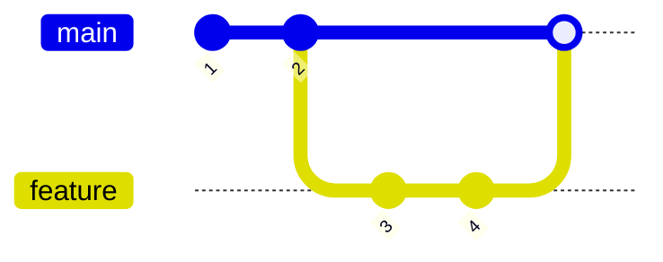
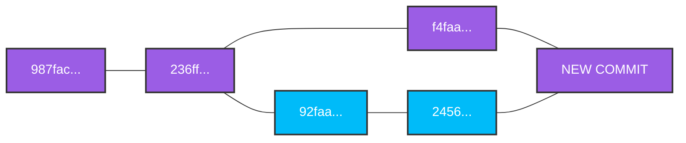

# An introduction to merging branches

 First - we merge branches and not commits.

Second - we merge to the current HEAD is.

You switch to the branch you want to merge into:

```bash
git switch master
```

	Then you select the branch you want to absorb:

```bash
git merge bugFixBranch
```
# Performing a fast forward merge

A fast forward merge happens when the target branch has no new commits since the source branch split off, allowing Git to simply move the target branch pointer ahead. This move brings the target branch up to the latest commit of the source branch without creating a new merge commit.



# Generating merge commits



All commits have a parent - this will be the first commit with two parents.
# test
# test
# test
# test