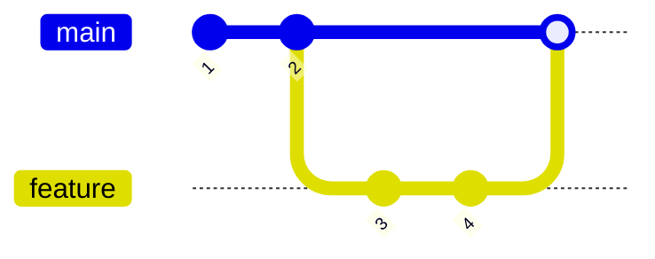
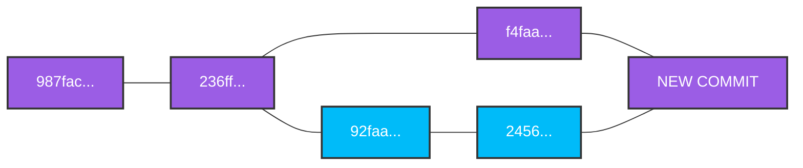

# An introduction to merging branches

 First - we merge branches and not commits.

Second - we merge to the current HEAD is.

You switch to the branch you want to merge into:

```bash
git switch master
```

	Then you select the branch you want to absorb:

```bash
git merge bugFixBranch
```
# Performing a fast forward merge

A fast forward merge happens when the target branch has no new commits since the source branch split off, allowing Git to simply move the target branch pointer ahead. This move brings the target branch up to the latest commit of the source branch without creating a new merge commit.



# Generating merge commits



All commits have a parent - this will be the first commit with two parents.
# Resolving Merge Conflicts

Whenever you encounter merge conflicts, follow these steps to resolve them:

1. Open up the file(s) with merge conflicts
    
2. Edit the file(s) to remove the conflicts. Decide which branch's content you want to keep in each conflict. Or keep the content from both.
    
3. Remove the conflict "markers" in the document
    
4. Add your changes and then make a commit!
    

## Questions you might have missed

**What command helps find these files?** Run `git status` to see a list of all conflicted files.

How do you stage the fixed files? Use git add after removing the markers to mark the conflict as resolved.

# Labs

This exercise is a little bit different. Rather than following my exact instructions step by step, I'd like for you to come up with your own scenarios that meet my requirements.

Start by creating a new repo. Make a file or two in the repo for you to work on.

If you need some inspiration...I'll be working in a file called `greetings.txt` It will contain greetings in different languages.

## Part 1: Fast Forward Merge

Your goal is to generate a fast forward merge. Demonstrate that you understand how FF merges work by creating one on your own!

Make a new branch. Do some work in the repo such that when you merge the new branch into master, it results in a fast forward merge. Merge that branch into master and see if you were right!

## Part 2: Merge Commit (No Conflicts)

Your goal is to generate a merge commit with NO MERGE CONFLICTS.

Create a new branch. Make some changes to the repo such that when you merge the new branch into master, it results in a merge commit. The merge should not result in any conflicts. Merge that branch into master and see if you were right!

## Part 3: Conflicts!

Your goal is to generate merge a conflict!

Create a new branch. Make some changes to the repo such that when you merge the new branch into the master branch, it results in a merge conflict. Merge that branch into master and see if you were right! Resolve the conf